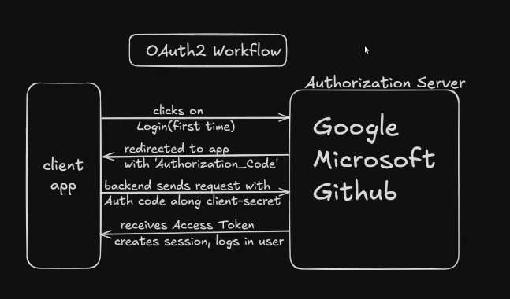
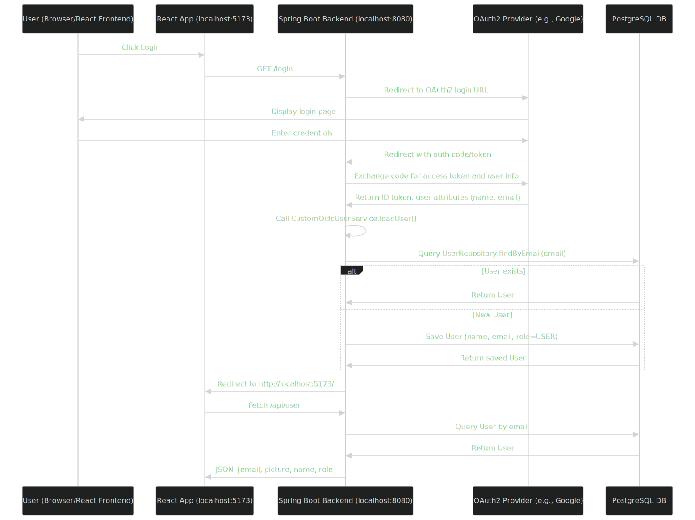
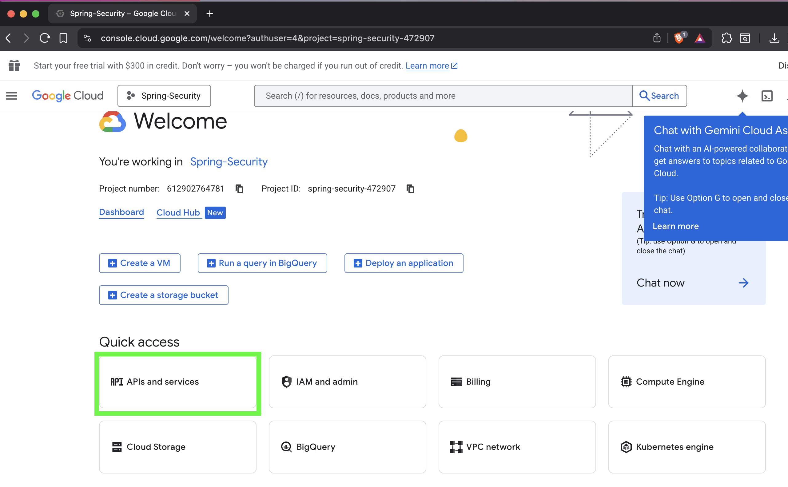
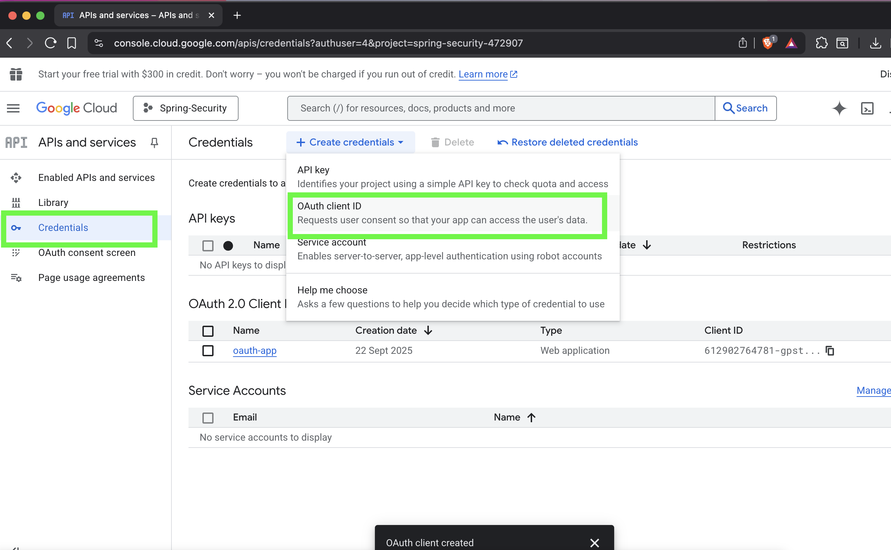
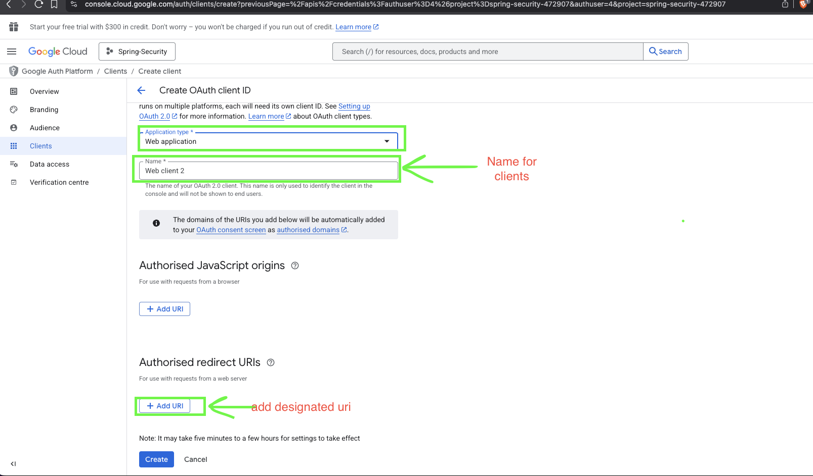

# OAuth2 : Secure Authentication with Spring Boot and React


[](https://spring.io/projects/spring-boot)
[](https://openjdk.org/projects/jdk/21/)
[](https://react.dev/)


## Project Overview

This project demonstrates how to securely integrate Google OAuth2 with a Spring Boot backend and a React frontend, making it a practical starter kit for modern web apps requiring authentication and authorization. It integrates with Google OAuth2 for secure login, stores user data in a PostgreSQL database via Docker, and includes role-based access control (RBAC) for user and admin endpoints. The backend handles user registration during first login, and the frontend (running on port 5173, e.g., Vite) consumes protected APIs.

Key goals:
- Secure user authentication without storing passwords.
- Automatic user creation in the database on first OAuth2 login.
- Role-based endpoints (e.g., admin-only info).
- CORS support for frontend-backend communication.

## Features

- **OAuth2 Login**: Integrate with Google for seamless authentication.
- **User Management**: Auto-create users in DB with default `USER` role; support for `ADMIN` role.
- **Protected APIs**:
  - `/api/user`: Fetch user profile (email, name, role, picture).
  - `/api/info`: Admin-only endpoint.
- **Security**: Spring Security with custom OIDC service, cache-control headers, and exception handling.
- **Database**: PostgreSQL with Docker Compose for easy setup.
- **Frontend**: React app for login/logout and API consumption.

## Tech Stack

- **Backend**: Spring Boot 3.5, Spring Security, Spring Data JPA, Hibernate, PostgreSQL.
- **Frontend**: React (with Vite or similar), assuming basic setup for OAuth2 redirects.
- **Database**: PostgreSQL (Dockerized).
- **Tools**: Maven, Docker Compose.
- **OAuth2 Provider**: Google (configurable for others).

## Prerequisites

- Java 21 (tested; Java 17+ should also work).
- Maven 3.8+.
- Docker (for PostgreSQL).
- Node.js 18+ (for React frontend).
- Google Developer Console account for OAuth2 credentials.

## Architecture
### High-Level Architecture


*Description*: This diagram outlines the overall flow from user login to API consumption.

### OAuth2 Login Sequence

*Description*: This diagram details the step-by-step authentication process, including OAuth2 redirection and database interaction. 

## Setup Instructions

### 1. Clone the Repository
```bash
git clone https://github.com/neupanerabin/springboot-react-oauth2.git
cd springboot-react-oauth2

```
### 2. Configure OAuth2 Credentials

- Go to Google Developer Console.


- Create a new project and enable "Google+ API" or similar for OAuth2.


- Create OAuth2 credentials (Web application type).
-  Set Authorized Redirect URIs: `http://localhost:8080/login/oauth2/code/google`
`


- Save the Client ID and Client Secret. Put them into your `.env` or `application.yml`.
```
spring:
  application:
    name: OAuth2  # give the designated name

  security:
    oauth2:
      client:
        registration:
          google:
            client-id: { your-google-client-id-here}
            client-secret: { add secret key}  # google secret key
            redirect-uri: "http://localhost:8080/login/oauth2/code/google"  # give us the authorization code
            scope:
              - openid
              - email
              - profile
        provider:
          google:
            issuer-uri: https://accounts.google.com

logging:
  level:
    '[org.springframework.security.oauth2]': DEBUG
```

### 3. Database Setup

Use the provided `docker-compose.yml`  to start PostgreSQL:

- To start the docker
```
docker-compose up -d
docker compose down -> for stope and remove
```

``` 
services:
  postgres:
    container_name: oauth
    image: postgres
    environment:
      POSTGRES_USER: postgres # database username
      POSTGRES_PASSWORD: rabin  # database password
      POSTGRES_DB: oAuth  # Add this to create the database automatically
      PGDATA: /var/lib/postgresql/data
    ports:
      - "5432:5432"
    volumes:
      - postgres_data:/var/lib/postgresql/data
volumes:
  postgres_data:

```

### 4. Run the Backend
- Build and run Spring Boot:
```
mvn clean install
mvn spring-boot:run
```
Backend runs on http://localhost:8080.

### 5. Run the Frontend

Navigate to your React app directory 
bashcd frontend

`cd ../oauth-ui-app-frontend`
```
bash
cd oauth-ui-app-frontend
npm install
npm run dev
```

### 6. Test the Application

- Open `http://localhost:5173` in your browser.
- Click Login → Redirect to Google → Authenticate → Redirect back to app.
- Fetch /api/user to see profile data.
